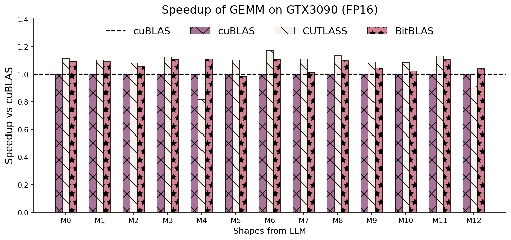
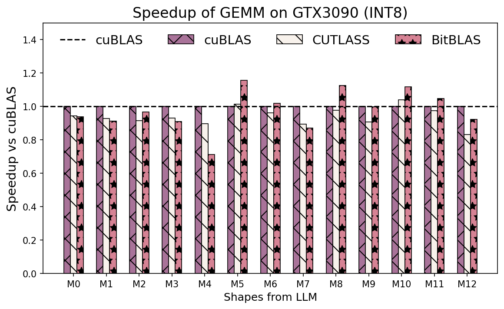

# BitBLAS

BitBLAS is a light weight framework to generate high performance CUDA/HIP code for BLAS operators with swizzling and layout propagation. BitBLAS can achieve comparable performance with vendor libraries across different platforms and hardware and aims to assist algorithm developers, such as those working on BitNET, GPTQ, and similar projects, in quickly implementing accelerate kernels and deploying them efficiently.

Some of the key features of BitBLAS include:
  - Auto Tensorize compute with TensorCore-like hardware instructions.
  - High Performance (Not only FP16xFP16, INT8xINT8, but also FP16xINT4/2/1, INT8xINT4/2/1).
  - With the flexible DSL (TIR Script) to effortlessly craft domain-specific kernels for your situations.
  - Support with dynamic symbolic throuth tvm unity -> generate source code with dynamic shape.
  - BitBLAS first proposed int8xint1 gemv/gemm with 10x/2x speedup over float16xfloat16 on A100, please checkout [op_benchmark_a100_int1_scaling](images/figures/op_benchmark_a100_int1_scaling.png) for detailed input scaling benchmark results.

## Benchmark
BitBLAS can achieve optimal performance across various compute patterns:

- GTX 3090
  - FLOAT16xFLOAT16 with TensorCore 
  - INT8xINT8 with TensorCore 
  - FLOAT16xAF4(LUT4) GEMV 
  - FLOAT16xAF4(LUT4) with TensorCore 

- A100
  - WeightOnly GEMV 
  - WeightOnly GEMM with TensorCore 

See more details in our [benchmark](./benchmark) directory.

## Getting Started

- Installation:
  To manually install BitBLAS, please checkout `maint/scripts/installation.sh`. Also Make sure you already have the cuda toolkit (version >= 11) installed in the system. Or you can install from `python setup.py install` or `pip install .` in the root directory. 

- [QuickStart](./docs/QuickStart.md): We provide two primary ways to do the code generation: using a high-level DSL (TensorIR Script), or using packed Operators, from the quick start guide, you can learn how to use BitBLAS to generate high performance kernels with both methods.

- [3rd Party Integration](./integration/): BitBLAS can also be easily integrated to other frameworks, the integration provides some examples of integrating BitBLAS with PyTorch, AutoGPTQ or vLLM.

## Contributing

This project welcomes contributions and suggestions. Most contributions require you to agree to a Contributor License Agreement (CLA) declaring that you have the right to, and actually do, grant us the rights to use your contribution. For details, visit https://cla.opensource.microsoft.com.

When you submit a pull request, a CLA bot will automatically determine whether you need to provide a CLA and decorate the PR appropriately (e.g., status check, comment). Simply follow the instructions provided by the bot. You will only need to do this once across all repos using our CLA.

This project has adopted the Microsoft Open Source Code of Conduct. For more information see the Code of Conduct FAQ or contact opencode@microsoft.com with any additional questions or comments.

## Trademarks

This project may contain trademarks or logos for projects, products, or services. Authorized use of Microsoft trademarks or logos is subject to and must follow Microsoft's Trademark & Brand Guidelines. Use of Microsoft trademarks or logos in modified versions of this project must not cause confusion or imply Microsoft sponsorship. Any use of third-party trademarks or logos are subject to those third-party's policies.

## Acknowledgement

We learned a lot from the following projects.

- [Apache TVM](https://github.com/apache/tvm): BitBLAS havs adopted TensorIR as our DSL. Additionally, we have customized TVM from the unity branch to incorporate specific features that were required for our project.
- [Microsoft Roller](https://github.com/microsoft/nnfusion/tree/roller): The design and algo inspiration of hardware aware tuning in BitBLAS comes from Roller,.
